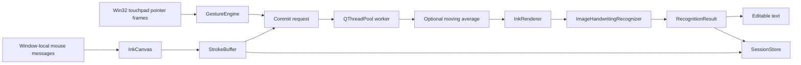

# Architecture

## Design goals

TouchWrite separates OS input, online ink, rendering, recognition, UI state, and persistence so that
an online trajectory model can be added without replacing the working image pipeline. Input data is
local and append-only. ML inference never runs on the Qt UI thread.



## Component boundaries

- `input`: normalized contact events, deterministic gesture recognition, and Win32 integration.
- `ink`: typed points/strokes/words, feature enrichment, smoothing, bounding boxes, and rendering.
- `recognition`: model-independent contracts plus image, future online, and ensemble boundaries.
- `services`: application orchestration with no Qt dependency.
- `ui`: Qt rendering, keyboard state transitions, background worker signals, and editable text.
- `persistence`: atomic JSON metadata and lossless local PNG files.
- `tools`: repeatable evaluation and dataset export.

## Word commit sequence

```mermaid
sequenceDiagram
    participant U as User
    participant UI as Qt UI thread
    participant W as Recognition worker
    participant M as Cached TrOCR
    participant D as Local dataset
    U->>UI: Space / Enter / commit gesture
    UI->>UI: Snapshot trajectories; retain ink
    UI->>W: Word + terminator + context
    W->>W: Smooth and render
    W->>M: Generate beam candidates
    M-->>W: Raw prediction + alternatives
    W->>D: Save trajectory, raw image, processed image
    W-->>UI: CommitOutcome signal
    UI->>UI: Insert editable text; clear committed ink
```

If inference fails, the worker emits an error and the canvas retains the original word.

## Tradeoffs

- TrOCR provides a practical pretrained offline baseline but was trained on handwriting images, not
  laptop touchpad trajectories. The recognizer interface keeps it replaceable.
- Conservative moving-average smoothing removes small jitter without spline-induced letter changes.
- No database is needed for an append-only personal dataset; per-sample folders remain transparent
  and exportable.
- UI input is temporarily disabled for the word being recognized. The event loop remains responsive,
  but queuing a new word during inference is deferred to avoid cross-word state corruption.
- Beam outputs are preserved as alternatives. They are not presented as calibrated confidence.

